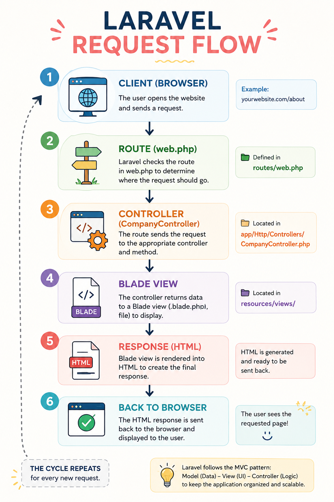

# Company Profile Website – Laravel Documentation

## 1. Project Title

**Company Profile Website**

A simple company profile website developed using Laravel, Blade, HTML, CSS, and JavaScript.

## 2. Introduction

### What is a Company Profile Website?

A company profile website is a website that introduces a company and provides important information about its business. It can include the company's background, services, contact information, and other details that visitors may want to know.

### Why Businesses Need One

Businesses need a website because it gives them an online presence. Instead of depending only on physical advertisements or social media, a company can use its website as a place where customers can easily learn about its services and contact the business.

### Purpose of the Project

The purpose of this project was to create a simple company profile website while learning how Laravel works. The project allowed me to practice routing, controllers, Blade templates, reusable components, and organizing files using Laravel's folder structure.

## 3. Objectives

The objectives accomplished in this project were:

- Create a company profile website using Laravel.
- Create Home, About, Services, and Contact pages.
- Set up routes using `routes/web.php`.
- Create and use `CompanyController`.
- Use Blade templates for the website pages.
- Create reusable navigation and footer components.
- Create a reusable layout for the pages.
- Organize the project using Laravel's recommended folder structure.
- Improve the visual design and layout of the website.
- Test the pages and fix problems that appeared during development.

## 4. MVC Architecture

### What is MVC?

MVC stands for **Model-View-Controller**. It is a way of organizing an application into separate parts.

- **Model** handles data and data-related operations.
- **View** handles what the user sees.
- **Controller** handles requests and connects the routes with the appropriate views or application logic.

For this project, the Controller and View parts were the most noticeable because the website mainly displays company information.

### Why Laravel Uses MVC

Laravel uses the MVC architecture because it helps keep the project organized. Instead of putting the routes, page design, and application logic in one place, each part has its own responsibility.

This makes the project easier to understand and maintain, especially when the application becomes larger.

### Advantages of MVC

Some advantages of using MVC are:

- **Organization** – Files have specific responsibilities.
- **Maintainability** – Changes are easier to manage.
- **Reusability** – Components and layouts can be reused.
- **Less repeated code** – Common elements do not need to be recreated.
- **Easier debugging** – Problems can be easier to locate.

### Laravel Request Flow

```text
Browser
   │
   ▼
Route (web.php)
   │
   ▼
CompanyController
   │
   ▼
Blade View
   │
   ▼
HTML Response
   │
   ▼
Browser
```

### Architecture Diagram

The project contains the architecture diagram in:

```text
documentation/
└── laravel_architecture_diagram.png
```



## 5. Laravel Routing

### What is Routing?

Routing determines what Laravel should do when a user visits a particular URL.

The web routes for this project are stored in:

```text
routes/web.php
```

For example:

```php
Route::get('/about', [CompanyController::class, 'about'])
    ->name('about');
```

When the user visits `/about`, Laravel finds the matching route and calls the `about()` method of `CompanyController`.

### Named Routes

Named routes give routes a name that can be used when creating links.

Example:

```php
Route::get('/services', [CompanyController::class, 'services'])
    ->name('services');
```

The route can then be used in Blade with:

```php
route('services')
```

Named routes make links easier to manage because the application can refer to the route by its name instead of repeatedly writing the URL.

### GET Requests

A GET request is normally used when a user wants to access or view a page.

Example:

```php
Route::get('/', [CompanyController::class, 'home'])
    ->name('home');
```

### Route Definitions

The project uses `web.php` to define the pages of the company profile website.

Example:

```php
use App\Http\Controllers\CompanyController;

Route::get('/', [CompanyController::class, 'home'])->name('home');
Route::get('/about', [CompanyController::class, 'about'])->name('about');
Route::get('/services', [CompanyController::class, 'services'])->name('services');
Route::get('/contact', [CompanyController::class, 'contact'])->name('contact');
```

### Screenshot

The route screenshot should be included in the documentation from the project's screenshots folder.

```text
screenshots/
└── web-routes.png
```

## 6. Controllers

### Purpose of Controllers

A controller receives requests from routes and determines what should happen next.

The main controller used in this project is:

```text
app/
└── Http/
    └── Controllers/
        └── CompanyController.php
```

The `CompanyController` handles the different pages of the company profile website.

### Benefits of Controllers

Controllers help because they:

- Keep routes organized.
- Group related page methods together.
- Make the application easier to maintain.
- Separate request handling from the page design.
- Make the project's structure easier to understand.

### Controller Methods

The controller can contain methods for the different pages.

Example:

```php
public function home()
{
    return view('pages.home');
}

public function about()
{
    return view('pages.about');
}

public function services()
{
    return view('pages.services');
}

public function contact()
{
    return view('pages.contact');
}
```

Each method returns the Blade page that should be displayed.

### Screenshot

The controller screenshot should be included from:

```text
screenshots/
└── company-controller.png
```

## 7. Blade Templating Engine

Blade is Laravel's templating engine. It allows PHP applications to create reusable HTML templates.

The Blade files in this project are located inside:

```text
resources/
└── views/
    ├── components/
    │   ├── footer.blade.php
    │   └── navbar.blade.php
    ├── layouts/
    └── pages/
        ├── about.blade.php
        ├── contact.blade.php
        ├── home.blade.php
        └── services.blade.php
```

### Blade Layouts

The `layouts` folder is used for layout-related Blade files. A layout provides a common structure that different pages can use.

This is useful because elements that are shared between pages do not need to be written repeatedly.

### Blade Components

The project has reusable components:

```text
resources/views/components/
├── footer.blade.php
└── navbar.blade.php
```

The navigation bar and footer can be reused across different pages.

### `@extends`

`@extends` allows a Blade page to use another Blade file as its layout.

Example:

```php
@extends('layouts.layout')
```

The exact layout filename depends on the layout file being used in the project.

### `@section`

`@section` defines content that will be placed in a section of the layout.

```php
@section('content')
    <h1>Welcome to Our Company</h1>
@endsection
```

### `@yield`

`@yield` defines where section content will appear in a layout.

```php
@yield('content')
```

The content inside the child page's `@section('content')` will be placed there.

### `@include`

`@include` allows another Blade file to be inserted into the current page.

```php
@include('components.navbar')
```

A footer can also be included:

```php
@include('components.footer')
```

### Why Blade Was Useful in This Project

Blade made it easier to keep the pages consistent. Instead of creating the navigation bar and footer separately for every page, I could reuse the same components.

This also made it easier to update common UI elements because I only needed to change the component instead of changing every page separately.

## 8. Laravel Folder Structure

### `app/`

Contains the main application code.

```text
app/
└── Http/
    └── Controllers/
        ├── CompanyController.php
        └── Controller.php
```

### `routes/`

Contains the application's route definitions.

```text
routes/
├── console.php
└── web.php
```

### `resources/`

Contains files used to build the application's interface.

```text
resources/
├── css/
├── js/
└── views/
```

### `public/`

Contains files that can be accessed publicly by the browser.

### `bootstrap/`

Contains files used during Laravel's application startup and initialization process.

### `config/`

Contains Laravel's configuration files and application settings.

### `documentation/`

The project contains:

```text
documentation/
└── laravel_architecture_diagram.png
```

This folder stores project documentation materials.

### `screenshots/`

The project contains:

```text
screenshots/
├── about_page.png
├── contact_page.png
├── footer.png
├── github_repository.png
├── home_page.png
├── laravel_file_structure.png
├── navbar.png
└── service_page.png
```

## 9. Screenshots

The project already contains screenshots for the main website pages and other important parts.

- **About Page:** `screenshots/about_page.png`
- **Contact Page:** `screenshots/contact_page.png`
- **Footer:** `screenshots/footer.png`
- **GitHub Repository:** `screenshots/github_repository.png`
- **Home Page:** `screenshots/home_page.png`
- **Laravel File Structure:** `screenshots/laravel_file_structure.png`
- **Navigation Bar:** `screenshots/navbar.png`
- **Services Page:** `screenshots/service_page.png`

Screenshots of `web.php`, `CompanyController.php`, and the Blade layout can also be added if they are required by the instructor.

## 10. Problems Encountered

### 1. Understanding How the Laravel Files Were Connected

At first, it was a little confusing to understand how the files in `routes`, `app/Http/Controllers`, and `resources/views` worked together. I knew what each file contained, but I had to understand how a user's request moved from the route to the controller and then to the Blade page.

### 2. Managing Different Blade Files

Another challenge was keeping track of the different Blade pages and reusable components. Since the project has separate pages for Home, About, Services, and Contact, I needed to make sure that the correct view was being used for each route.

### 3. Keeping the Navbar and Footer Consistent

It was also challenging to keep the navbar and footer looking consistent on every page. Small differences in spacing, positioning, or styling could make one page look slightly different from another.

### 4. Making the Website Look Good on Different Screen Sizes

Another problem was making the layout look good when the browser size changed. Some sections could look fine on a large screen but become too crowded or misaligned on a smaller screen.

### 5. Fixing Small UI Details

There were also small UI issues such as spacing, element alignment, button positioning, and section sizes. These details were sometimes difficult to notice until I actually viewed the website in the browser.

### 6. Deciding on a Suitable Design

I sometimes had difficulty deciding how to arrange sections on the pages. I wanted the website to look professional but still simple enough for a company profile website.

## 11. Solutions

### 1. Understanding the Laravel Flow

I reviewed the connection between the route, controller, and view and followed the request flow step by step.

```text
Browser
   ↓
web.php
   ↓
CompanyController.php
   ↓
resources/views/pages/
   ↓
HTML Response
   ↓
Browser
```

This helped me understand the purpose of each part instead of treating the Laravel folders as separate files.

### 2. Organizing the Blade Files

I kept the page files inside:

```text
resources/views/pages/
```

and the reusable UI files inside:

```text
resources/views/components/
```

This made it easier to know where each type of Blade file belonged.

### 3. Reusing the Navbar and Footer

I used reusable Blade components for the navbar and footer. This helped reduce repeated code and made it easier to update these elements across the website.

### 4. Testing Different Screen Sizes

I tested the website using different browser sizes and adjusted the layout when something looked crowded or misaligned.

### 5. Checking the UI in the Browser

Instead of only checking the code, I regularly opened the website and looked at how the elements actually appeared. I adjusted spacing, sizing, alignment, and positioning based on what I saw.

### 6. Using Design References

I used **Dribbble** to look for layout ideas and inspiration. This helped me decide how to arrange sections and UI elements while still creating my own version of the design.

## 12. Reflection

Developing this Laravel company profile website helped me understand MVC in a more practical way. Before creating the project, I understood MVC mostly as a concept, but working with Laravel showed me how the different parts actually communicate with each other. I learned that MVC separates responsibilities so that the application does not become one large collection of mixed code.

The most important thing I learned was the relationship between routes, controllers, and views. When a user visits a page, Laravel first checks the route defined in `web.php`. The route determines which controller method should handle the request. The controller then returns the appropriate Blade view, which is eventually rendered as HTML and displayed in the browser. Seeing this process through my own project made the Laravel request flow easier to understand.

I also realized why separation of concerns is important. If the route definitions, page design, and application logic were all placed in the same file, making changes would become confusing. With MVC, I can work on a Blade page without having to rewrite the route. I can also modify a controller method without changing the entire page structure. This organization makes the project easier to maintain.

Blade was another part of the project that I found useful. The reusable navbar and footer helped me avoid repeating the same code on every page. If I wanted to change a common element, I could update its component instead of editing every page separately. This showed me how reusable components can save time.

One of my challenges was not only understanding the code but also making the website look good. I had difficulty with layouts, spacing, alignment, responsive behavior, and deciding where certain elements should be placed. Sometimes the UI looked different from what I expected when I viewed it in the browser. To help with this, I used Gemini AI for UI suggestions and used Dribbble as a reference for layout ideas. I still checked and adjusted the results myself.

Overall, this project improved both my Laravel skills and my understanding of web development. I learned that building a website is not only about making the code work; the structure and user interface also matter. I believe MVC can be applied to larger enterprise systems because it provides a clear structure for organizing many features, pages, controllers, and data-related processes. As a system becomes larger, having this separation can make it easier for developers to work together, maintain the application, and add new features.

## 13. References

Laravel. (n.d.). *Laravel documentation*. https://laravel.com/docs

MDN Web Docs. (n.d.). *MDN Web Docs*. https://developer.mozilla.org/

PHP Documentation Group. (n.d.). *PHP manual*. https://www.php.net/docs.php

Tailwind Labs. (n.d.). *Tailwind CSS documentation*. https://tailwindcss.com/docs

Dribbble. (n.d.). *Dribbble*. https://dribbble.com/
::: ​​
